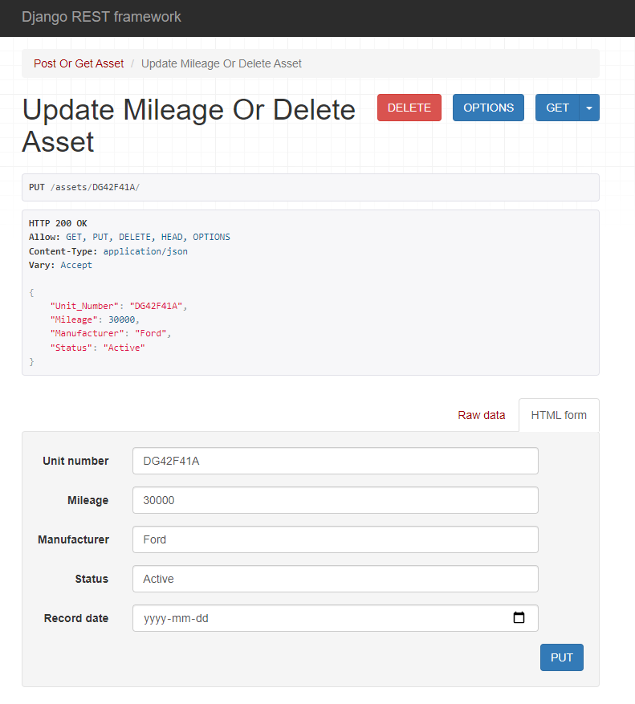
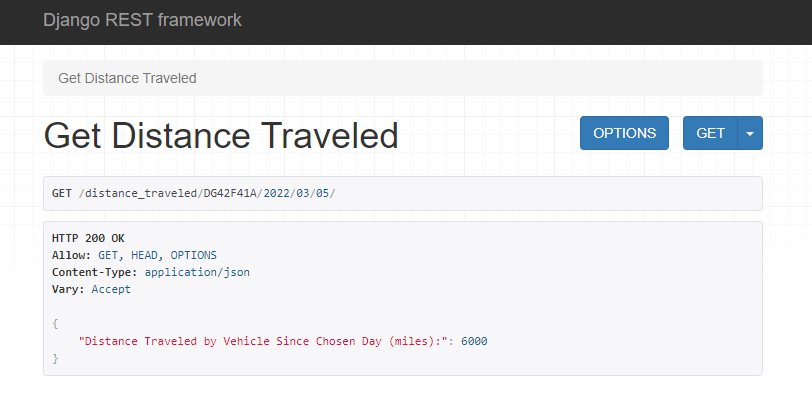

# Vehicle-Distance-Traveled Django App

## Introduction:

This simple Django REST framework project can be used to enter, update, or delete vehicle records in a SQLite database and to compute the distance traveled by a vehicle from a chosen date to the present day.

## **Steps to run project:**

1. Clone or download project and enter into resultant folder
2. Create and activate a new virtual environment (https://docs.python-guide.org/dev/virtualenvs/) or activate an existing one in terminal/command prompt.
3. Enter into subsequent directory (vehicle_project). A requirements.txt file should be present in this folder as well as an identically named inner vehicle_project folder and vehicle_app.
4. Run the following command: pip install -r requirements.txt.  
5. In shell, run command: python manage.py runserver. This should start the local development server.
6. For convenience, type http://127.0.0.1:8000/assets/ into a web browser address bar. The existing vehicle records should be displayed. The command line can also be used for requests.

## The following API endpoints are available in this project (should be typed after localhost address):

- 'assets/' – for viewing and adding Vehicle records
- 'assets/unit_number/', where unit_number is a string representing a vehicle’s primary key – this address may be used to update or delete a Vehicle
- 'mileage_records/' - returns a full list of all mileage values entered during additions or updates
- 'mileage_records/unit_number/' – for viewing the mileage values entered for a specific vehicle
- 'mileage_records/unit_number/year/month/day/' – for viewing the mileage value entered for a specific vehicle on a certain day, the year, month, and day fields all being integer values.
- 'distance_traveled/unit_number/year/month/day/' - this endpoint will provide the distance a specified vehicle has travelled from the particular day entered until now (the latest mileage value present). Try http://127.0.0.1:8000/distance_traveled/DG42F41A/2022/03/05/ as an example.

## Assumptions made:

- Unit # Vehicle primary key will never exceed 8 characters in length
- Manufacturer names are no more than 50 characters
- Mileage only entered once at the end of every day
- No days are missed in entering mileage, allowing the distance method to work without checking for missing values or interpolating. Distance travelled will only work for existing records.
- Mileage will never go down between days
- Assume all mileage values are rounded to the nearest integer
- Vehicle status is not confined to just active or inoperative, making a boolean field infeasible
- The latest mileage value is always stored in the Vehicle table

## Important Notes:

- The MILEAGE_RECORDS table will have a new entry added any time a new vehicle is added or a mileage is updated on an existing vehicle.  
- A date must be included for every POST and PUT operation. This was included to allow for testing and demonstration of the distance computation. In practice, the timestamp would be saved automatically. The date value is not saved in the VEHICLE database table.
- Although only Mileage and Status are updated for vehicles, Unit Number, Manufacturer, and RecordDate must also be included in PUT requests. When updating, the entered Unit Number should exactly match its counterpart in the URL address. This includes any trailing spaces.  
- Mileage value updates lower than the current VEHICLE table value must be given an earlier date. Similarly, greater values must be dated later. Greater values will replace current mileage.

## Samples:

